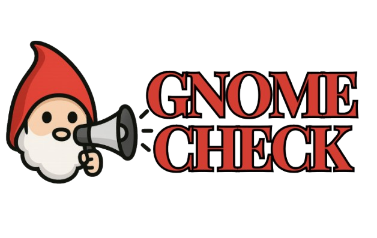

<p align="center">
  
</p>

O GnomeCheck é uma ferramenta criada pelos Gnomos para combater a desinformação em plataformas de vídeos curtos. Ele transcreve o áudio do vídeo e, com auxílio de IA, avalia a confiabilidade das informações considerando fontes citadas, viéses na fala e alarmismo.

## 📝 》Requisitos

- Google Chrome
- Python 3.8 ou superior
- [pip](https://pip.pypa.io/en/stable/installation/)
- Token OPENAI_API_KEY no .env

## 📖 》Rodando Localmente (Flask)

### Instalação de Dependências

Clone o repositório:
```
git clone https://github.com/Petroncini/GnomeCheck.git
cd GnomeCheck
```

Crie e ative um ambiente virtual (opcional, mas recomendado):
```
python3 -m venv venv
source venv/bin/activate
```

Instale as dependências:
```
pip install -r requirements.txt
```

### Iniciando o servidor Flask (macos ou linux)

```
python3 analiser.py
```

Acesse o servidor local em [http://127.0.0.1:5000](http://127.0.0.1:5000).

## 💻 》Como usar

- Abra o Google Chrome
- Acesse [chrome://extensions/](chrome://extensions/)
- Ative o "Developer Mode"
- Clique em "Load Unpack"
- Selecione a pasta extension
- Agora a extensão já está carregada
- Finalmente, clique no ícone e envie uma link de reels/shorts
